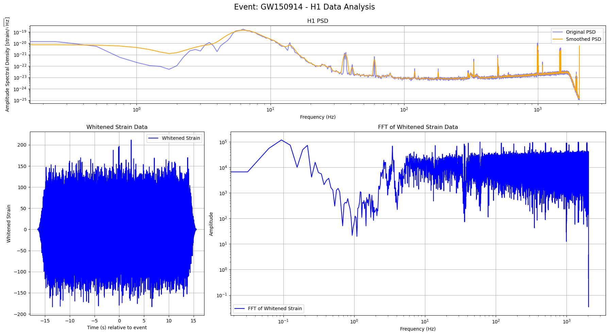
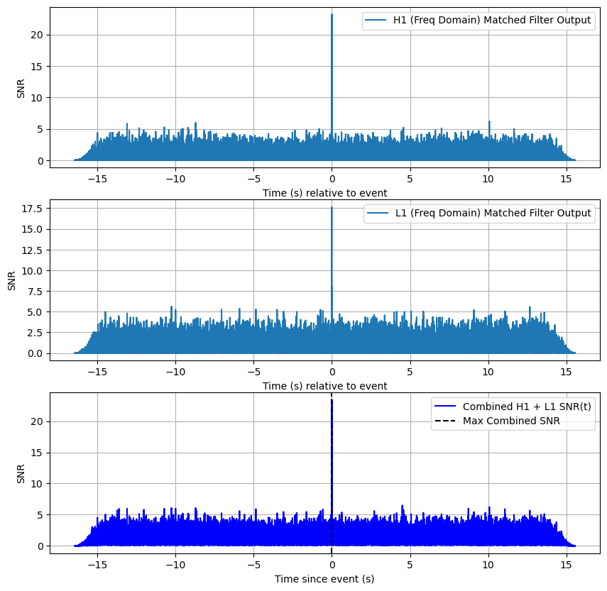
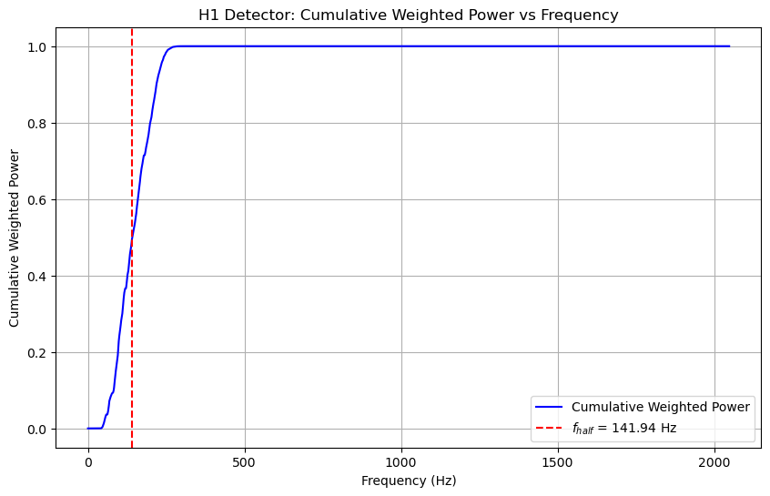
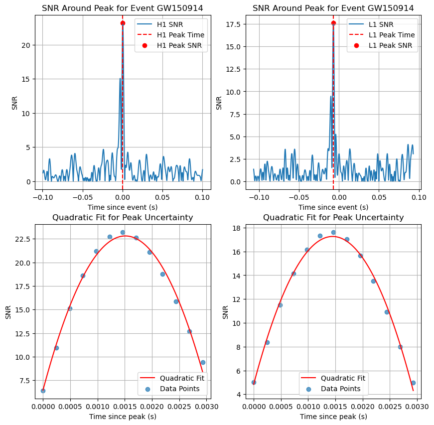

# Gravitational Waves (LIGO Data Analysis) - Noise Modeling

## Overview

The data used for this analysis is obtained from LIGO's Gravitational Wave Event Data Releases and is contained under the LOSC_Event_tutorial-master folder.

This repository provides an analysis tool for modeling noise in LIGO detector data as a step towards gravitational wave detection. The package is designed to process data from the Livingston (L1) and Hanford (H1) detectors, analyze noise characteristics, and apply matched filtering techniques to identify gravitational wave signals.

The code includes features for analyzing multiple events, such as GW150914, and provides visual outputs for each analysis. If you encounter any issues or discrepancies (e.g., normalization problems), feel free to open an issue. Contributions are welcome, especially in refining the noise model and improving the accuracy of SNR calculations.

---

## Features

1. **Noise Analysis**:
   - **Data Windowing**: Applies a Tukey window to mitigate edge effects and reduce spectral leakage. The flat-top region avoids tapering the central region where the gravitational wave signal is expected to dominate.
   - **Power Spectral Density (PSD)**: Calculates the PSD using Welch's method, allowing for customization of segment length, overlap, and window type. Segment length, overlap, and window type are customizable for optimal resolution.
   - **Smoothing the PSD**: Uses Gaussian kernel smoothing to highlight broadband noise features and improve noise reduction. A Gaussian kernel, implemented via FFT convolution, is used to smooth the PSD and highlight broadband noise features. The bandwidth for smoothing is adjustable, allowing for targeted noise reduction without distorting significant features.
   - **Addressing Line Noise**: Narrow-band noise is reduced through PSD smoothing, though additional techniques such as notch filtering can be integrated. Narrow-band "lines" are implicitly handled by smoothing, although further techniques (e.g., notch filtering) can be integrated if needed.

2. **Prewhitening and Matched Filtering**:
   - **Prewhitening**: Normalizes the strain data by dividing frequency components by the square root of the smoothed PSD, flattening the noise spectrum for better signal detection. This process is essential to flatten the noise spectrum, enabling better signal detection.
   - **Bandpass Filtering**: Isolates the frequency range most relevant to gravitational wave signals, typically between 30 Hz and 400 Hz. This step eliminates noise outside the target band and focuses the analysis on the range where most astrophysical signals are expected.
   - **Matched Filtering**: Performs matched filtering in the frequency domain to maximize the signal-to-noise ratio (SNR) and identify potential gravitational wave signals. It involves comparing the preprocessed strain data from the detectors to theoretical templates of gravitational wave signals. This process maximizes the SNR to identify potential signals.

3. **Event Analysis**:
   - Provides SNR calculations for multiple gravitational wave events such as GW150914, LVT151012, GW151226, and GW170104.
   - Visualizes results for both the Hanford and Livingston detectors, including PSD plots, whitened strain data, and FFTs of the strain data.

3. **Half-Weight Frequency Calculation**:
   - Calculates the half-weight frequency, which divides the power spectrum into two equal parts in terms of cumulative weighted power. This provides insights into the frequency distribution of the signal's power.

3. **Time Uncertainty Calculation**:
   - Calculates the uncertainty in the peak time of the SNR using a quadratic fit to the SNR curve around the peak. This helps in estimating the precision of the signal detection.


  
---

## Usage

### Files
- **`GW_detector.py`**: Contains functions to preprocess LIGO data, construct noise models, and implement matched filtering.

### Running the Analysis
The repository includes a script to process gravitational wave events and visualize the noise characteristics and matched filtering results. You can run the analysis for different events and compare the output for each detector. Results include SNR values, whitening analysis, and visual plots.


For a detailed analysis, you can adjust parameters such as segment length, window type, and smoothing bandwidth to suit different events or detectors.

### Outputs
The analysis outputs include:
- **Power Spectral Density (PSD)**: Visual representations of the PSD for both Hanford and Livingston detectors.
- **Whitened Strain Data**: Plots of the prewhitened strain data, emphasizing the removal of low-frequency noise.
- **Matched Filtering Results**: SNR plots showing the potential gravitational wave signals and their likelihood.
-  **Fhalf**:calculates the half-weight frequency , which divides the power spectrum into two equal parts in terms of cumulative weighted power.
-  **Time uncertainty**: calculates the uncertainty in the peak time of the SNR using a quadratic fit to the SNR curve around the peak.

#### Signal processing (SNR)

 #### Hanford Detector (H1) for GW150914 event

   

   The figure above shows the following for the Hanford (H1) detector:
   1. **Top Plot (H1 PSD)**: 
      - The original PSD (blue) shows significant frequency-domain noise variations, with clear narrow-band noise ("lines") around specific frequencies.
      - The smoothed PSD (orange) highlights broadband noise while suppressing narrow-band features, providing a clearer representation of the detector's sensitivity.

   2. **Bottom Left Plot (Whitened Strain Data)**:
      - The whitened strain data in the time domain, aligned relative to the gravitational wave event, demonstrates the removal of low-frequency trends and noise artifacts.

   3. **Bottom Right Plot (FFT of Whitened Strain Data)**:
      - The FFT of the whitened strain data shows how noise contributions have been redistributed uniformly across the frequency domain.

#### Signal-to-Noise Ratio (SNR)




### Comparative Results for Gravitational Wave Events

The table below summarizes the SNR values for the four gravitational wave events:

| **Event**       | **H1 Max SNR** | **L1 Max SNR** | **Combined SNR** |
|-----------------|----------------|----------------|------------------|
| **GW150914**    | 23.22          | 17.64          | 29.16            |
| **LVT151012**   | 8.31           | 7.81           | 11.41            |
| **GW151226**    | 11.42          | 8.48           | 14.23            |
| **GW170104**    | 10.65          | 13.27          | 17.01            |

---
### Half-weight frequency
The find_half_weight_frequency function calculates the half-weight frequency , which divides the power spectrum into two equal parts in terms of cumulative weighted power. 



The attached graph illustrates the cumulative weighted power as a function of frequency for the H1 detector:

Blue Line (Cumulative Weighted Power):

This curve shows how the weighted power accumulates across frequencies.
At low frequencies, the cumulative weighted power increases steeply, indicating that the majority of the signal power resides at these frequencies.

Red Dashed Line:

This line marks the half-weight frequency , where the cumulative weighted power reaches 0.5.
In this example, Fhalf≈141.94Hz, meaning half of the signal’s weighted power comes from frequencies below 141.94 Hz, and half comes from above. This lies in the typical range for binary black hole mergers. Also interestingly, its where their instruments are most sensetive to these kinds of detections (thanks veritasium!)

### Time uncertainty




The figure consists of four subplots that illustrate the time of arrival uncertainty estimation for the **GW150914** event:

1. **Bottom Left: Quadratic Fit for H1**:
   - The quadratic fit closely follows the data points around the H1 SNR peak, confirming the parabolic behavior of the SNR curve near its maximum.
   - The time uncertainty for H1 is precise, reflecting the sharper SNR peak.

2. **Bottom Right: Quadratic Fit for L1**:
   - The quadratic fit matches the data points well for L1 but shows a slightly wider curve due to the lower SNR.
   - The resulting uncertainty is higher than H1, highlighting the impact of signal strength on localization precision.


```python
H1 Detector: Peak Time = 0.0004 s relative to event
H1 Detector: Time Uncertainty (delta_t) = 0.000264 s

L1 Detector: Peak Time = -0.0069 s relative to event
L1 Detector: Time Uncertainty (delta_t) = 0.000291 s

Time Difference (Delta t) between L1 and H1: -0.007324 s
Uncertainty in Time Difference (delta_Dt): 0.000393 s

--- Localization Summary for Event GW150914 ---
Time Difference (Delta t): -0.007324 s
Uncertainty in Delta t (delta_Dt): 0.000393 s
```


### Observations and Future Improvements

- **Strongest Detection**: The combined SNR values indicate that **GW150914** is the most confident detection among the analyzed events.
- **Weakest Detection**: **LVT151012** has the lowest combined SNR (**11.41**), suggesting either a weaker signal or higher noise levels in the detectors for this event.
- **Detector Contributions**: The relative contributions of the Hanford (H1) and Livingston (L1) detectors vary by event, but combining their outputs consistently improves the detection confidence. In some cases (e.g., **GW170104**), L1 exhibits a higher SNR than H1, demonstrating its importance in the detection process.
- **Improvements Needed**: There may be discrepancies in the normalization, which could affect the results. Contributions are welcome to improve the accuracy of the whitening and normalization procedures.
- **Both Polarizations**: The package supports toggling between using only the plus polarization or both polarizations, enhancing signal detection accuracy.

The combined SNR values highlight the critical role of data integration from both H1 and L1 detectors in gravitational wave astronomy. By combining their outputs, we achieve greater confidence in the detection and characterization of gravitational wave signals. The SNR values are relatively good when compared with the literature.


---

## Contact
For more details or questions, please reach out through GitHub or email.

