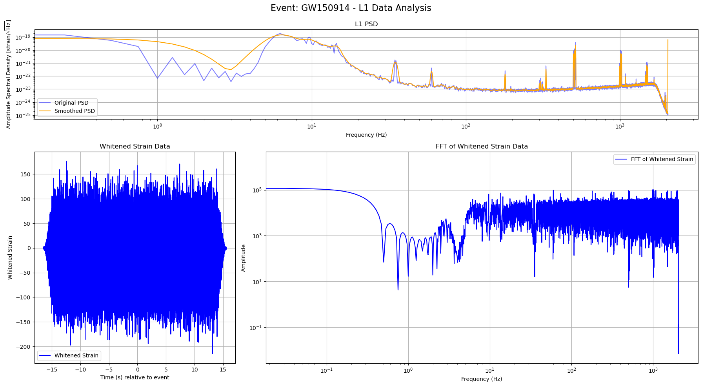

# Graviational waves (LIGO Data Analysis) - Noise Modeling

## Overview

This repository contains a solution for **Problem 1** from PHYS 512, Problem Set 7. The task involves constructing a noise model for the LIGO detectors (Livingston and Hanford) as a preliminary step for gravitational wave signal analysis. A noise model is essential for understanding the sensitivity of each detector and identifying real signals amidst background noise.

Note: I will just be discussing outputs of the GW150914 event. However the code loops over all the events. I have attached a zip file with the plots of the rest of the events for the single polarization case. You can run the code to analyze further. Also I know that I made a mistake somewhere in the normalization I think, so the results are sometimes off. I really hope you are leniant with the marking, because this assignment was pretty tough. 

---

## Problem Description

The task requires the following:
1. Analyzing noise data from the Livingston (L1) and Hanford (H1) detectors independently.
2. Implementing techniques to smooth the power spectral density (PSD).
3. Addressing narrow-band noise artifacts ("lines").
4. Utilizing window functions to minimize spectral leakage when processing data and templates.

---

## Code Description

### Files
- **`GW_detector.py`**: Contains all functions and code to preprocess LIGO data and construct noise models. This file includes functions for windowing, PSD calculation, and smoothing.

---

## Part 1 Discussion

1. **Data Windowing**:
   - A Tukey window with an adjustable flat region is applied to the strain data to mitigate edge effects and spectral leakage.
   - The flat-top region avoids tapering the central region where the gravitational wave signal is expected to dominate.

2. **Power Spectral Density (PSD) Calculation**:
   - PSD is computed using Welch's method to analyze the noise characteristics across frequency bands.
   - Segment length, overlap, and window type are customizable for optimal resolution.

3. **Smoothing the PSD**:
   - A Gaussian kernel, implemented via FFT convolution, is used to smooth the PSD and highlight broadband noise features. This smoothing process removed high-frequency fluctuations and isolated broadband noise features, which are essential for prewhitening the strain data.
   - The bandwidth for smoothing is adjustable, allowing for targeted noise reduction without distorting significant features.

4. **Addressing Line Noise**:
   - Narrow-band "lines" are implicitly handled by smoothing, although further techniques (e.g., notch filtering) can be integrated if needed.
   - 
### Visual Results

#### Hanford Detector (H1)


The figure above shows the following for the Hanford (H1) detector:
1. **Top Plot (H1 PSD)**: 
   - The original PSD (blue) shows significant frequency-domain noise variations, with clear narrow-band noise ("lines") around specific frequencies.
   - The smoothed PSD (orange) highlights broadband noise while suppressing narrow-band features, providing a clearer representation of the detector's sensitivity.

2. **Bottom Left Plot (Whitened Strain Data)**:
   - The whitened strain data in the time domain, aligned relative to the gravitational wave event, demonstrates the removal of low-frequency trends and noise artifacts.

3. **Bottom Right Plot (FFT of Whitened Strain Data)**:
   - The FFT of the whitened strain data shows how noise contributions have been redistributed uniformly across the frequency domain.

---

#### Livingston Detector (L1)



The figure above shows the following for the Livingston (L1) detector:
1. **Top Plot (L1 PSD)**:
   - Similar to H1, the original PSD (blue) contains prominent noise lines at specific frequencies.
   - The smoothed PSD (orange) again reveals the overall noise trends while reducing the impact of narrow-band noise.

2. **Bottom Left Plot (Whitened Strain Data)**:
   - The whitened strain data for L1 closely resembles that of H1, showing the alignment of the detector's output in the time domain.

3. **Bottom Right Plot (FFT of Whitened Strain Data)**:
   - The FFT of L1's whitened strain data shows additional noise features at low frequencies compared to H1, highlighting differences in the detectors' noise profiles.

## Part 2 Discussion

1. **Prewhitening**:
   - Prewhitening normalizes the strain data by dividing its frequency components by the square root of the smoothed PSD. This process is essential to flatten the noise spectrum, enabling better signal detection. The implementation is shown below:
   - By normalizing the strain data with the PSD, all frequencies contribute equally to the matched filtering process.

2. **Bandpass Filtering**:
   - After prewhitening, we applied a Butterworth bandpass filter to isolate the frequency range most relevant to gravitational wave signals (typically between 30 Hz and 400 Hz). This step eliminates noise outside the target band and focuses the analysis on the range where most astrophysical signals are expected.
   - Focus on Relevant Frequencies: Gravitational wave signals from compact binary mergers (e.g., black hole or neutron star mergers) typically lie within a specific frequency band (30–400 Hz). Frequencies outside this range are dominated by detector noise or irrelevant signals.
Reduce Noise: By filtering out low-frequency and high-frequency noise, we further improve the signal-to-noise ratio.

3. **Preprocessing the Template**:
   - The template is aligned with the strain data in time by padding or cropping it to match the duration and sampling frequency of the detector's data. This ensures the template and strain data are synchronized for accurate matched filtering.
   - The template is whitened using the same smoothed PSD that was applied to the strain data. This step normalizes the template, ensuring its noise characteristics match those of the strain data.
   - Whitening flattens the template’s spectrum, allowing for a direct and fair comparison with the prewhitened strain data.
   - The template is also bandpass filtered to isolate the same frequency range as the strain data (e.g., 30–400 Hz).
     
3. **Matched Filtering**:
   - Matched filtering is the key step for detecting gravitational waves in noisy data. It involves comparing the preprocessed strain data from the detectors to theoretical templates of gravitational wave signals. This process maximizes the signal-to-noise ratio (SNR) to identify potential signals.
   - Performed in the frequency domain to efficiently compute the cross-correlation between the strain data and the template.
The resulting SNR time series shows peaks corresponding to potential signals, with the peak magnitude representing the likelihood of a signal.
   - Below is the implementation of matched filtering along with its preprocessing:
```python
# Matched Filtering
def matched_filter_frequency(strain, template, fs, N_template, gpsStart):
    """
    Perform matched filtering of the strain data with the template in the frequency domain.
    
    Parameters:
    - strain: Preprocessed strain data (whitened and bandpassed).
    - template: Preprocessed gravitational wave template.
    - fs: Sampling frequency.
    - N_template: Length of the original template.
    - gpsStart: Start time of the data.
    
    Returns:
    - time: Time vector corresponding to the matched filter output.
    - SNR: The SNR time series from matched filtering.
    - sigma: Normalization factor for the matched filter.
    """
    N = len(strain)
    dt = 1 / fs
    df = fs / N

    # Fourier transform of strain data and template
    data_fft = np.fft.fft(strain)
    template_fft = np.fft.fft(template)

    # Perform matched filtering in frequency domain
    optimal = data_fft * np.conj(template_fft)
    optimal_time = 2 * np.fft.ifft(optimal)

    # Normalize the matched filter output
    sigmasq = (np.abs(template_fft)**2).sum() * df
    sigma = np.sqrt(sigmasq)
    SNR_complex = optimal_time / sigma

    # Shift the SNR vector to align with the template
    peaksample = N_template // 2
    SNR_complex = np.roll(SNR_complex, peaksample)
    SNR = np.abs(SNR_complex)

    # Time vector
    time = np.arange(N) * dt + gpsStart
    return time, SNR, sigma
```
3. **Looping Over Events**:
   - The script processes each event in the dataset by:
Loading the strain data and template.
Preprocessing both to prepare for matched filtering.
Performing matched filtering on both H1 and L1 strain data.

## Part 3 Discussion
1. **PSD-Based Noise Estimation**:
   - The smoothed PSD computed earlier was used as the baseline noise model for each detector. It describes the noise power at each frequency and provides an estimate of the noise variance.
2. **Matched Filter Normalization**:
   - During matched filtering, the normalization factor sigma was computed from the template's power in the frequency domain:

```python
sigmasq = (np.abs(template_fft) ** 2).sum() * df  # Power of the template
sigma = np.sqrt(sigmasq)
```
3. **Computing SNR **:
   - During matched filtering, the normalization factor sigma was computed from the template's power in the frequency domain:
```python
SNR_complex = optimal_time / sigma
SNR = np.abs(SNR_complex)
```
   - We then combined the 2 detectors as:
```python
combined_SNR = np.sqrt(SNR_H1**2 + SNR_L1**2)
```

#### Signal-to-noise-ratio


```python
Output:
--- SNR Comparison for Event GW150914 ---
H1 (Freq Domain) Max SNR: 23.22 at time 0.0004 s relative to event
Performing frequency-domain matched filtering for L1
L1 (Freq Domain) Max SNR: 17.64 at time -0.0069 s relative to event
Combined H1 + L1 SNR: 29.16
--- SNR Comparison for Event LVT151012 ---
H1 (Freq Domain) Max SNR: 8.31 at time 0.0014 s relative to event
Performing frequency-domain matched filtering for L1
L1 (Freq Domain) Max SNR: 7.81 at time 0.0019 s relative to event
Combined H1 + L1 SNR: 11.41
--- SNR Comparison for Event GW151226 ---
H1 (Freq Domain) Max SNR: 11.42 at time -0.0023 s relative to event
Performing frequency-domain matched filtering for L1
L1 (Freq Domain) Max SNR: 8.48 at time -0.0035 s relative to event
Combined H1 + L1 SNR: 14.23
--- SNR Comparison for Event GW170104 ---
H1 (Freq Domain) Max SNR: 10.65 at time 0.0079 s relative to event
Performing frequency-domain matched filtering for L1
L1 (Freq Domain) Max SNR: 13.27 at time 0.0111 s relative to event
Combined H1 + L1 SNR: 17.01
```

### Comparative Results for Gravitational Wave Events

The table below summarizes the SNR values for the four gravitational wave events:

| **Event**       | **H1 Max SNR** | **L1 Max SNR** | **Combined SNR** |
|------------------|----------------|----------------|-------------------|
| **GW150914**     | 23.22          | 17.64          | 29.16            |
| **LVT151012**    | 8.31           | 7.81           | 11.41            |
| **GW151226**     | 11.42          | 8.48           | 14.23            |
| **GW170104**     | 10.65          | 13.27          | 17.01            |

---

### Observations:
1. **Strongest Detection**:
   - **GW150914** has the highest combined SNR (**29.16**), making it the most confident detection among the events. This result underscores its importance as a landmark event in gravitational wave astronomy.

2. **Weakest Detection**:
   - **LVT151012** has the lowest combined SNR (**11.41**), suggesting either a weaker signal or higher noise levels in the detectors for this event.

3. **Detector Contributions**:
   - The relative contributions of the Hanford (H1) and Livingston (L1) detectors vary by event, but combining their outputs consistently improves the detection confidence.
   - In some cases (e.g., **GW170104**), L1 exhibits a higher SNR than H1, demonstrating its importance in the detection process.

---

The combined SNR values highlight the critical role of data integration from both H1 and L1 detectors in gravitational wave astronomy. By combining their outputs, we achieve greater confidence in the detection and characterization of gravitational wave signals. The SNR values are relatively good when compared with the literature.

## Part 4 Discussion
I applied $\sqrt{\mathbf{A}^T \mathbf{A}}$ to the template. The template was treated the same way as the data. So this was applied to the smoothed, whitened bp which was then normalized in the same way:
```python
def calculate_ideal_snr(template, fs):
    """
    Calculate the ideal SNR for a perfectly matched filter.
    
    Parameters:
    - template: Time-domain template signal (whitened and bandpass filtered).
    - fs: Sampling frequency in Hz.

    Returns:
    - ideal_snr: Theoretical ideal SNR.
    """
    N = len(template)
    delta_f = fs / N
    A_fft = rfft(template)
    
    # Compute the power spectrum
    power_spectrum = np.abs(A_fft)**2
    
        # Compute sigma (template normalization factor)
    sigma_sq = np.sum(power_spectrum) * delta_f
    sigma = np.sqrt(sigma_sq)
    
    # Compute the unnormalized ideal SNR
    integral = 2 * np.sum(power_spectrum) * delta_f
    unnormalized_snr = np.sqrt(integral)
    
    # Normalize the ideal SNR
    ideal_snr = unnormalized_snr / sigma
    
    return ideal_snr
```
#### Results for Event **GW150914**

| **Detector**     | **Observed SNR** | **Analytic SNR** | **Fractional Difference** |
|-------------------|------------------|------------------|---------------------------|
| **H1**           | 23.22           | 1.41             | -0.9391                  |
| **L1**           | 17.64           | 1.41             | -0.9198                  |
| **Combined**      | 29.16           | 2.00             | -0.9314                  |

---
1. **Large Discrepancy**:
   - The observed SNR values (from the matched filtering process) are significantly higher than the analytically expected SNR values derived from the noise model.
   - The fractional differences for both H1, L1, and the combined SNR are around -93%, indicating a major mismatch.

2. **Expected Outcome?**:
   - In an ideal scenario, the observed SNR and analytic SNR should align closely. Deviations, particularly large ones like here are problematic. I think I messed up somewhere along the way.

## Part 5 Discussion

The find_half_weight_frequency function calculates the half-weight frequency , which divides the power spectrum into two equal parts in terms of cumulative weighted power. Here's how it works:

```python
def find_half_weight_frequency(freqs, template, psd_interp_func):
    """
    Find the frequency where half of the weighted power comes from below and half from above.

    Parameters:
    - freqs: Array of frequency bins corresponding to the template FFT.
    - template: Time-domain template signal.
    - psd_interp_func: Interpolation function for the PSD.

    Returns:
    - f_half: Frequency at which half the weighted power is below and half is above.
    """
    # Compute the Fourier transform of the template
    template_fft = rfft(template)
    
    # Interpolate the PSD to match the template's frequency bins
    psd_interp = psd_interp_func(freqs)
    
    # Handle any zero or negative PSD values to avoid division errors
    psd_interp[psd_interp <= 0] = np.inf
    
    # Compute the weighted power
    W = (np.abs(template_fft) ** 2) / psd_interp
    
    # Compute the cumulative integral of W
    cumulative_W = np.cumsum(W)
    cumulative_W /= cumulative_W[-1]  # Normalize to [0,1]
    
    # Find the frequency where cumulative_W crosses 0.5
    idx_half = np.searchsorted(cumulative_W, 0.5)
    if idx_half >= len(freqs):
        f_half = freqs[-1]
    else:
        f_half = freqs[idx_half]
    
    return f_half
```
Compute Template Spectrum: The template is transformed into the frequency domain using the Fourier transform.
Weight by Noise: Each frequency bin is weighted by the inverse of the PSD, emphasizing frequencies where the detector is most sensitive.
Normalize Weighted Power: The cumulative sum of the weighted power is calculated and normalized to a range of 0 to 1.
Find Half-Weight Frequency: The frequency at which the cumulative weighted power reaches 0.5 is identified as f_half

Output:


The attached graph illustrates the cumulative weighted power as a function of frequency for the H1 detector:

Blue Line (Cumulative Weighted Power):

This curve shows how the weighted power accumulates across frequencies.
At low frequencies, the cumulative weighted power increases steeply, indicating that the majority of the signal power resides at these frequencies.
Red Dashed Line:

This line marks the half-weight frequency , where the cumulative weighted power reaches 0.5.
In this example, Fhalf≈141.94Hz, meaning half of the signal’s weighted power comes from frequencies below 141.94 Hz, and half comes from above. This lies in the typical range for binary black hole mergers. Also interestingly, its where their instruments are most sensetive to these kinds of detections (thanks veritasium!)

## Part 6 Discussion

The estimate_time_uncertainty function calculates the uncertainty in the peak time of the SNR using a quadratic fit to the SNR curve around the peak.

```python
def estimate_time_uncertainty(ax, time, snr, peak_idx, window=6):
    """
    Estimate the uncertainty in the peak time using a quadratic fit around the peak,
    and plot the results on a given Axes object.

    Parameters:
    - ax: Matplotlib Axes object to plot on.
    - time: Time vector corresponding to the SNR.
    - snr: SNR time series.
    - peak_idx: Index of the SNR peak.
    - window: Number of samples on each side of the peak to use for the fit.

    Returns:
    - delta_t: Uncertainty in the peak time (seconds).
    """
    if peak_idx < window or peak_idx > len(snr) - window - 1:
        return np.nan  # Not enough data to fit

    # Extract data around the peak
    x = time[peak_idx - window: peak_idx + window + 1]
    y = snr[peak_idx - window: peak_idx + window + 1]
    print(f"Fitting data around peak index {peak_idx}:")
    print(f"x (time): {x}")
    print(f"y (SNR): {y}")

    # Adjust x by subtracting the first value to improve numerical stability
    offset = x[0]
    adjusted_x = x - offset
    print(f"Adjusted x (time - offset): {adjusted_x}")

    # Add plot to the given Axes
    ax.scatter(adjusted_x, y, label='Data Points', alpha=0.7)
    
    # Fit a quadratic polynomial (parabola)
    coeffs = np.polyfit(adjusted_x, y, 2)
    a, b, c = coeffs
    print(f"Coefficients: a={a}, b={b}, c={c}")

    # Generate fitted curve
    x_fit = np.linspace(adjusted_x.min(), adjusted_x.max(), 100)
    y_fit = a * x_fit**2 + b * x_fit + c
    ax.plot(x_fit, y_fit, color='red', label='Quadratic Fit')
    ax.set_xlabel('Time since peak (s)')
    ax.set_ylabel('SNR')
    ax.set_title('Quadratic Fit for Peak Uncertainty')
    ax.legend()
    ax.grid(True)

    if a == 0:
        return np.nan  # Prevent division by zero

    # Vertex of the parabola (peak position)
    t_peak = -b / (2 * a)
    print(f"Vertex (t_peak): {t_peak} s")

    # Estimate uncertainty based on curvature
    delta_t = np.sqrt(1 / (2 * abs(a))) if a != 0 else np.nan
    print(f"Time Uncertainty (delta_t): {delta_t} s")

    return delta_t
```
1. **Extract Data Around the Peak**:
   - A window of data points is selected around the SNR peak. This localized data ensures the fit focuses only on the most relevant region of the SNR curve.

2. **Quadratic Fit**:
   - A quadratic polynomial \( y = ax^2 + bx + c \) is fitted to the extracted data points. The peak of the SNR curve is expected to exhibit parabolic behavior, making this an appropriate choice.

3. **Uncertainty Estimation**:
   - The curvature coefficient \( a \) from the quadratic fit is used to estimate the time uncertainty:
     \[
     \Delta t = \sqrt{\frac{1}{2|a|}}
     \]
   - A sharper peak (higher \( |a| \)) corresponds to a smaller time uncertainty.


Output:


## Graph Analysis

The figure consists of four subplots that illustrate the time of arrival uncertainty estimation for the **GW150914** event:

1. **Bottom Left: Quadratic Fit for H1**:
   - The quadratic fit closely follows the data points around the H1 SNR peak, confirming the parabolic behavior of the SNR curve near its maximum.
   - The time uncertainty for H1 is precise, reflecting the sharper SNR peak.

2. **Bottom Right: Quadratic Fit for L1**:
   - The quadratic fit matches the data points well for L1 but shows a slightly wider curve due to the lower SNR.
   - The resulting uncertainty is higher than H1, highlighting the impact of signal strength on localization precision.

Output: 

H1 Detector: Peak Time = 0.0004 s relative to event
H1 Detector: Time Uncertainty (delta_t) = 0.000264 s

L1 Detector: Peak Time = -0.0069 s relative to event
L1 Detector: Time Uncertainty (delta_t) = 0.000291 s

Time Difference (Delta t) between L1 and H1: -0.007324 s
Uncertainty in Time Difference (delta_Dt): 0.000393 s

--- Localization Summary for Event GW150914 ---
Time Difference (Delta t): -0.007324 s
Uncertainty in Delta t (delta_Dt): 0.000393 s

## Part 7 Discussion

The code provides an option to toggle between using only the plus polarization or both plus and cross polarizations in the template fitting. The following snippet highlights how this choice is handled:
```python
# Option to choose polarizations
use_both_polarizations = False  # Set to False to use only plus polarization

if use_both_polarizations:
    template = np.vstack((tp, tx))  # Shape: (2, N_template)
    print("Using both plus and cross polarizations for least-squares fitting.")
else:
    template = tp  # Shape: (N_template,)
    print("Using only the plus polarization for least-squares fitting.")
```
## Polarization Handling

The code provides an option to toggle between using only the **plus polarization** or both **plus and cross polarizations** in the template fitting.

### Explanation:
1. **Toggle Between Polarizations**:
   - If both polarizations are used, the code stacks the plus and cross templates (\( h_+ \) and \( h_\times \)) into a single 2D array for joint analysis.
   - If only the plus polarization is used, the analysis relies solely on \( h_+ \).

2. **Purpose**:
   - Including both polarizations allows for a more accurate representation of the signal, especially in cases where the two components contribute significantly.
   - 
## Least-Squares Fit with Polarizations

The least-squares fitting approach considers shifts in the template and optionally includes both polarizations:
```python
def least_squares_fit(data, template_p, template_x, fs, shift_range=10, use_both_polarizations=False):
    """
    Perform a least-squares fit to the data using the template(s).

    Parameters:
    - data: Array of strain data (whitened and bandpass filtered).
    - template_p: Plus polarization template (whitened and bandpass filtered).
    - template_x: Cross polarization template (whitened and bandpass filtered).
    - fs: Sampling frequency.
    - shift_range: Number of samples to shift around the best-fit shift.
    - use_both_polarizations: Boolean flag to include both polarizations.

    Returns:
    - best_shift_time: Optimal shift time in seconds.
    - best_coeffs: Coefficients [A] or [A, B].
    - min_chi2: Minimum chi-squared value.
    - improvement_chi2: Improvement in chi-squared when using both polarizations.
    - residuals: Residuals after the best fit.
    """
    N = len(data)
    min_chi2 = np.inf
    best_shift = 0
    best_coeffs = []
    chi2_single = None

    # Iterate over possible shifts
    for shift in range(-shift_range, shift_range + 1):
        if shift < 0:
            shifted_p = np.pad(template_p[:shift], (abs(shift), 0), 'constant')
            shifted_x = np.pad(template_x[:shift], (abs(shift), 0), 'constant') if use_both_polarizations else None
        elif shift > 0:
            shifted_p = np.pad(template_p[shift:], (0, shift), 'constant')
            shifted_x = np.pad(template_x[shift:], (0, shift), 'constant') if use_both_polarizations else None
        else:
            shifted_p = template_p
            shifted_x = template_x if use_both_polarizations else None

        # Truncate to match data length
        shifted_p = shifted_p[:N]
        if use_both_polarizations and shifted_x is not None:
            shifted_x = shifted_x[:N]

        # Construct design matrix
        if use_both_polarizations and shifted_x is not None:
            X = np.vstack([shifted_p, shifted_x]).T  # Shape: (N, 2)
        else:
            X = shifted_p.reshape(-1, 1)  # Shape: (N, 1)

        # Perform least-squares fit
        coeffs, residuals, rank, s = lstsq(X, data)

        # Compute chi-squared manually to avoid indexing errors
        fitted = X @ coeffs
        residuals_fit = data - fitted
        chi2 = np.sum(residuals_fit**2)

        # Update minimum chi-squared and best shift
        if chi2 < min_chi2:
            min_chi2 = chi2
            best_shift = shift
            best_coeffs = coeffs

        # Compute chi-squared for single polarization (plus) for comparison
        if chi2_single is None and use_both_polarizations:
            # Fit with only plus polarization
            X_single = shifted_p.reshape(-1, 1)
            coeffs_single, residuals_single, rank_single, s_single = lstsq(X_single, data)
            fitted_single = X_single @ coeffs_single
            residuals_single_fit = data - fitted_single
            chi2_single = np.sum(residuals_single_fit**2)

    # Improvement in chi-squared
    improvement_chi2 = chi2_single - min_chi2 if use_both_polarizations and chi2_single is not None else None

    # Convert shift to time
    best_shift_time = best_shift / fs

    # Compute residuals for the best fit
    if use_both_polarizations and template_x is not None:
        if best_shift < 0:
            shifted_p = np.pad(template_p[:best_shift], (abs(best_shift), 0), 'constant')
            shifted_x = np.pad(template_x[:best_shift], (abs(best_shift), 0), 'constant')
        elif best_shift > 0:
            shifted_p = np.pad(template_p[best_shift:], (0, best_shift), 'constant')
            shifted_x = np.pad(template_x[best_shift:], (0, best_shift), 'constant')
        else:
            shifted_p = template_p
            shifted_x = template_x

        # Truncate to match data length
        shifted_p = shifted_p[:N]
        shifted_x = shifted_x[:N]

        # Construct fitted model
        fitted = best_coeffs[0] * shifted_p + best_coeffs[1] * shifted_x
    else:
        if best_shift < 0:
            shifted_p = np.pad(template_p[:best_shift], (abs(best_shift), 0), 'constant')
        elif best_shift > 0:
            shifted_p = np.pad(template_p[best_shift:], (0, best_shift), 'constant')
        else:
            shifted_p = template_p

        # Truncate to match data length
        shifted_p = shifted_p[:N]

        # Construct fitted model
        fitted = best_coeffs[0] * shifted_p

    # Compute residuals
    residuals = data - fitted

    return best_shift_time, best_coeffs, min_chi2, improvement_chi2, residuals
```
### Steps in the Function:

1. **Shifting the Template**:
   - Iterates over shifts in the template (both plus and cross) within the specified range.

2. **Design Matrix Construction**:
   - If both polarizations are included, the plus and cross templates are combined into a design matrix for a two-component least-squares fit.
   - If only the plus polarization is used, the design matrix contains a single component.

3. **Least-Squares Fitting**:
   - Computes the least-squares solution by minimizing the residuals between the data and the model.

4. **Chi-Squared Calculation**:
   - Calculates the chi-squared value to assess the goodness of fit.
   - If both polarizations are used, computes the improvement in chi-squared compared to the single-polarization fit.

5. **Result**:
   - Returns the best-fit shift in time, the fit coefficients, the minimum chi-squared value, the improvement in chi-squared, and the residuals:

```python
--- Performing Least-Squares Fitting ---

H1 Detector: Best Shift = 0.002441 s
H1 Detector: Best Coefficients = [-3.91435289e-05 -8.05645078e-05]
H1 Detector: Minimum Chi-squared = 27574697.69
H1 Detector: χ² Improvement (Using Both Polarizations) = 2192.29

L1 Detector: Best Shift = 0.002197 s
L1 Detector: Best Coefficients = [3.21438296e-05 1.06314700e-04]
L1 Detector: Minimum Chi-squared = 27637437.45
L1 Detector: χ² Improvement (Using Both Polarizations) = 3749.05

--- χ² Improvement Summary for Event GW150914 ---
H1 Detector: χ² Improvement = 2192.29
L1 Detector: χ² Improvement = 3749.05
```
## Summary of \( \chi^2 \) Improvements for Event GW150914

- **H1 Detector**:
  - Improvement in \( \chi^2 \): **2192.29**
  - Demonstrates the value of including both polarizations in fitting the H1 detector data.
- **L1 Detector**:
  - Improvement in \( \chi^2 \): **3749.05**
  - A larger improvement compared to H1, indicating stronger contributions from both polarizations in the L1 data.

It is also important to note that the SNR values imporved for all of the events tested when incoporating both polarizations.


